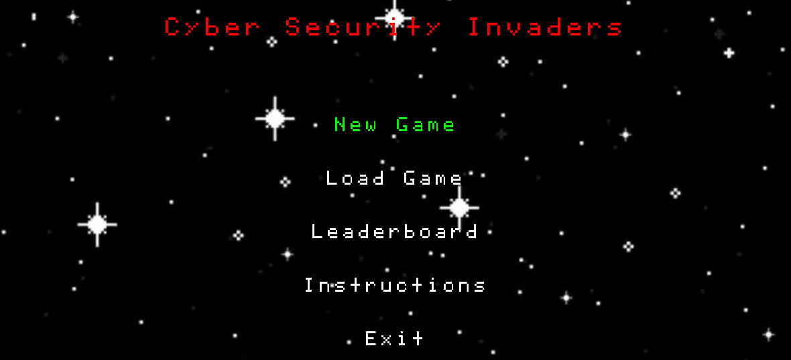

# 🛡️ Cyber Security Invaders  

**Cyber Security Invaders** is an educational arcade game that combines cybersecurity learning with fast-paced action. Battle through hacker waves, defeat the final boss, and climb the leaderboard while learning vital security concepts!

[](https://python.org)  
[](https://pygame.org)  
[](https://raspberrypi.org)

 

## 🚀 New Features & Enhancements

### 🕹️ Gameplay Additions
- **Boss Battles** 👾 - Face off against massive final bosses at the end of each level
- **Power-Up System** ⚡  
  - *Laser Beams*: Super-charged attacks  
  - *Energy Shields*: Temporary invulnerability  
  - *Triple Shot*: Triple your firepower  
  - *Score Multipliers*: Rack up bonus points  
- **7-Segment Display Integration** 🔢 (Raspberry Pi) - Real-time score tracking  
- **Dual LED Feedback** 💡 (RPi) - Green/red LEDs for correct/incorrect answers

### 🛠️ System Features
- **Save/Load System** 💾 - 3 save slots with timestamped backups  
- **Networked Leaderboard** 🌐 - Global score tracking via Flask server  
- **Animated Menus** 🎭 - Dynamic background animations  
- **Enhanced Soundtrack** 🎵 - Level-specific music and SFX  
- **Gameplay Instructions** 📖 - Built-in gameplay instructions  

## 📦 Installation

### Requirements
- Python 3.8+  
- Pygame 2.1.3  
- Raspberry Pi (optional for hardware features)

```bash
# Clone repository
```bash
git clone https://github.com/yourusername/cyber-security-invaders.git
cd cyber-security-invaders
```

# Install dependencies
```bash
pip install -r requirements.txt
```

# Raspberry Pi extras
```bash
pip install RPi.GPIO
```

## 🎮 Controls

| Action              | Keyboard       |
|---------------------|----------------|
| Move Left           | ← Arrow        | 
| Move Right          | → Arrow        | 
| Shoot               | Spacebar       | 
| Pause/Menu          | ESC            |  
| Menu Navigation     | ↑/↓ Arrows     |  
| Confirm Selection   | Enter          | 

## 🧠 Cybersecurity Features

### Educational Q&A System ❓
- Randomly generated security questions
- Multiple-choice format
- Progressive difficulty

### Security Concepts Covered 🔐
- Phishing attacks
- Password security
- Network protocols
- Malware types
- 2FA fundamentals

## 🌟 Special Features

## # Raspberry Pi Hardware Integration
```python
if is_raspberry_pi:
    GPIO.setup([SEGMENT_PINS, LED_PINS], GPIO.OUT)
    threading.Thread(target=update_7seg_display).start()
```

### Real Hardware Feedback 🖥️
- 4-digit 7-segment score display
- Dual-color LED answer feedback
- GPIO-based controls

## 📊 Leaderboard System

# # Cloud-based score tracking
```python
response = requests.post("https://5269989.pythonanywhere.com/submit_score")
```
- Global high score tracking
- Secure authentication
- Automatic score validation
- Mobile-friendly display

## 🛠️ Troubleshooting

| Issue               | Solution                                   |
|---------------------|--------------------------------------------|
| Missing dependencies| `pip install -r requirements.txt`         |
| GPIO permissions    | Run with `sudo`                            |
| Display not working | Check wiring & pin assignments            |
| Server unavailable  | Play in offline mode                      |

## 📜 License
MIT License - See LICENSE for details

## 🙌 Acknowledgements
- Pygame community for graphics framework
- Raspberry Pi Foundation for hardware support
- Open-source cybersecurity resources
